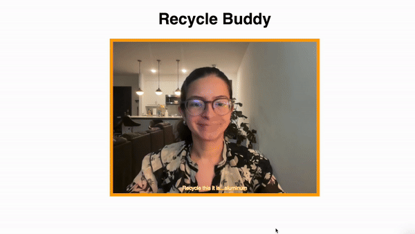
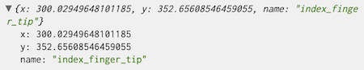

# Summary

Building off the ml5.js hand pose pre-trained model I was able to use the provided keypoints to determine how many fingers were being held up by any given hand. This was done to provide more information to the use case of recycling plastic. 

Example keypoint: 

 

# Integration Process
First, I worked on a new project, that only used ml5.js to determine how many fingers on a hand were held up. I brainstormed my approach by following guidance from this linkedin post: https://www.linkedin.com/pulse/real-time-finger-counting-powered-opencv-reid-glaze/
1)	I calculated a circular boundary for the full hand area.
2)	I measured which fingertip was outside of this boundary, indicating it was being held up.
4)	Once working, I refactored the code to instead use a hand object class, as demonstrated in our last lab lecture.
5) Then once that was working as expected, I combined it with the milestone 1 work so it would only consider the fingers held up when it had identified plastic.

# Enhanced Functionality
Now, with the extra information of number of fingers held up, the program can know what kind of plastic it is identifying and improve the user experience to give more specific recycling guidance.

# Narrated Demo Video
https://youtu.be/5hQfuAguwF8 
